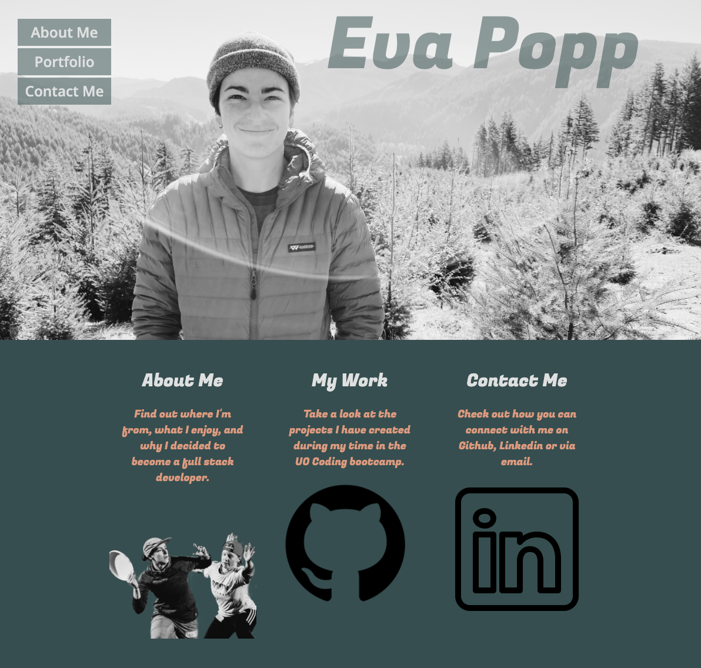

# Portfolio

## Objective 
Welcome to my professional portfolio which I have created during my time in the University of Oregon Fullstack Bootcamp. The site includes a brief bio on the "About Me" page, a "Portfolio" page displaying some of the projects I have created, and a "Contact Me" page which has linked my github, linkedin, email and resume. This site was built using HTML and CSS technologies. 

## Links 

* Deployed Site: https://evapopp.github.io/homework-portfolio/
* Repo: https://github.com/evapopp/homework-portfolio

## Page Preview

